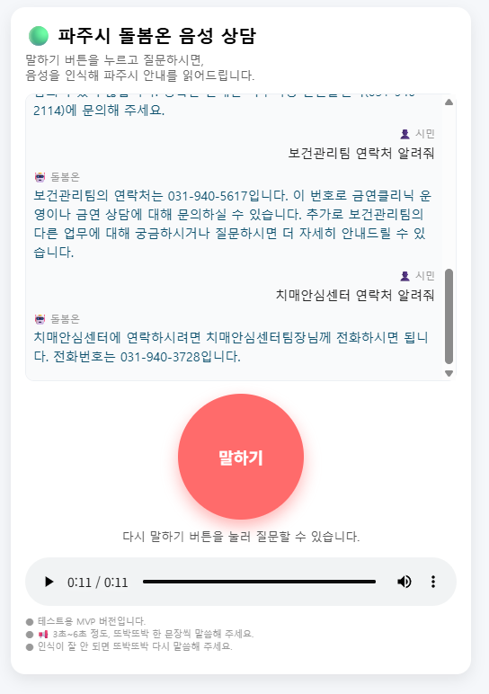
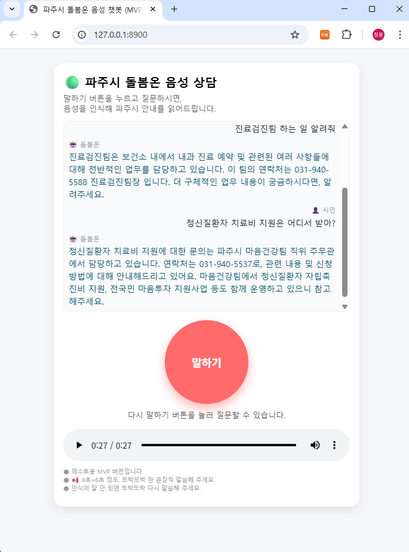

# 파주시 AI 민원 상담 챗봇 '돌봄온' (MVP)

이 프로젝트는 파주시청의 민원, 복지, 건강 관련 문의에 답변하는 AI 음성 챗봇 '돌봄온'의 MVP(Minimum Viable Product) 버전입니다.

FastAPI를 기반으로 STT(Speech-to-Text), RAG(Retrieval-Augmented Generation), LLM(Large Language Model), TTS(Text-to-Speech) 기술을 통합하여 사용자에게 음성 기반의 대화형 서비스를 제공합니다.

## 🎬 시연 영상

[](https://youtube.com/shorts/gLKFxrx5eSY)
> (썸네일을 클릭하면 유튜브 시연 영상으로 이동합니다.)

## ✨ 주요 기능

- **음성 대화**: 마이크를 통해 질문하고 음성으로 답변을 받습니다.
- **고성능 STT**: `faster-whisper`를 GPU(CUDA) 환경에서 실행하여 빠르고 정확한 음성 인식을 수행합니다.
- **문서 기반 답변 (RAG)**: `rank-bm25`를 사용하여 파주시 조례, 규정, 연락처 등 내부 데이터베이스에서 질문과 가장 관련 높은 문서를 검색하고, 이를 LLM의 답변 생성에 활용합니다.
- **LLM 답변 생성**: SKT의 A.X(에이닷엑스) GPT 모델을 활용하여 검색된 정보를 바탕으로 자연스러운 답변을 생성합니다.
- **TTS 음성 출력**: `gTTS`를 사용하여 생성된 텍스트 답변을 음성 파일로 변환하여 제공합니다.

## ⚙️ 시스템 아키텍처

```
┌───────────────┐      ┌───────────────────┐      ┌───────────────────┐
│   User        │----->│ FastAPI Server    │----->│   RAG Service     │
│(Browser/Mic)  │      │(paju_careon_fastapi.py)  │ (rag_service.py)  │
└───────────────┘      └───────────────────┘      └───────────────────┘
       ▲                 | 1. Audio Upload        | 
       |                 | 2. STT (faster-whisper)|
       |                 | 3. Query               |
       |                 | 4. Retrieve Context    |
       |                 | 5. Generate Answer     |
       |                 | 6. TTS (gTTS)          |
       |                 | 7. Return JSON         |
       |                 └────────────────────┬───┘
       |                                      |
       └──────────────────────────────────────┘
                         (Text, TTS URL)      |
                                              v
                                    ┌───────────────────┐
                                    │    SKT GPT API    │
                                    └───────────────────┘
```
## 의존성 설치
- pip install -r requirements.txt

- requirements.txt 파일이 없다면 주요 라이브러리(fastapi, uvicorn, whisper, transformers 등)를 직접 명시하고 설치하세요.


##  서버 실행
- uvicorn paju_careon_fastapi:app --host 0.0.0.0 --port 8000 --reload


## 🖼️ 실행 화면 예시
<table align="center">
  <tr>
    <td align="center">
      
      <br>
      <sub><b>STT 및 답변 생성/출력 화면</b></sub>
    </td>
    <td align="center">
      
      <br>
      <sub><b>TTS 음성 답변 재생 화면</b></sub>
    </td>
  </tr>
</table>

## 🧩 개발 환경 및 기술 스택

프로젝트는 다음의 환경과 기술을 기반으로 구축되었습니다. (`setting_backup.md` 및 `requirements.txt` 참고)

| 구분             | 기술               | 버전 / 모델                             | 설명                                         
| :-------------- | :---------------- | :-------------------------------------- | :----------------------------------------- 
| **Backend**     | Python            | `3.10`                                  | 핵심 프로그래밍 언어                          
|                 | FastAPI           | `0.121.2`                               | 고성능 웹 프레임워크                          
|                 | Uvicorn           | `0.38.0`                                | ASGI 서버                                   
| **AI / ML**     | **STT** (음성인식) | `faster-whisper` (`1.2.1`)              | GPU 가속 STT (Systran/faster-whisper-medium)
|                 | **RAG** (검색)     | `rank-bm25` (`0.2.2`)                   | 키워드 기반 문서 검색                         
|                 | **LLM** (답변생성) | SKT A.X (GPT)                           | `openai` (`2.8.0`) SDK 사용                  
|                 | **TTS** (음성합성) | `gTTS` (`2.5.4`)                        | Google Text-to-Speech                       
| **Data**        | JSON              | -                                       | 파주시 조례, 법령 및 민원문의처 데이터              
|                 | Pandas            | `2.3.3`                                 | 데이터 처리 및 가공                            
| **Environment** | **OS**            | Ubuntu `22.04.5` (on WSL2)              | 개발 및 실행 환경                            
|                 | **GPU / CUDA**    | NVIDIA GPU (CUDA `11.8` for PyTorch)    | `torch 2.5.x` 기반 GPU 연산                 
|                 | **Infra**         | Conda                                   | Python 가상환경 관리                         


## 🧱 향후 개선 방향

1.  **검색 정확도 향상 (Keyword → Semantic Search)**
    -   현재 `rank-bm25` 키워드 기반 검색을 **Vector DB** (e.g., `FAISS`, `Milvus`)와 임베딩 모델을 활용한 **Semantic Search**로 전환하여 문맥적 의미를 파악하는 검색 기능 구현.

2.  **STT/TTS 품질 고도화**
    -   **STT**: `faster-whisper-large-v3` 모델을 적용하여 음성 인식 정확도 향상.
    -   **TTS**: `gTTS`를 실시간 스트리밍 및 고품질 음성을 제공하는 `Naver CLOVA Voice` 또는 `Google Cloud TTS` API로 교체하여 사용자 경험 개선.

3.  **LLM 모델 다각화 및 최적화**
    -   외부 API 의존도를 낮추고 비용 효율성을 높이기 위해, 한국어 특화 **오픈소스 sLLM** (e.g., `Ko-Solar`, `Llama-3-Ko`)을 로컬 환경에서 직접 호스팅하여 운영하는 방안 검토.

4.  **대화형 기능 확장**
    -   단순 질의응답을 넘어, 이전 대화 내용을 기억하고 이어가는 **대화형 Agent** 기능 구현.
    -   "민원 접수해줘"와 같은 음성 명령을 인식하여 실제 업무 시스템과 연동하는 **Function Calling** 도입.

## 👤 제작자

- **이름**: KevinCY Kim (김창용)
- **GitHub**: https://github.com/KevinCY-Kim
- **이메일**: stonez788@gmail.com

## ©️ 저작권 및 사용권 (Copyright & License)

1.  **저작권 (Copyright)**
    -   본 프로젝트의 모든 창작물(소스 코드, AI 모델, 기획 문서, 발표 자료, 시연 영상 등)에 대한 저작권은 **제작자에게 귀속**됩니다.
    -   수상 여부와 관계없이 제작자는 결과물을 GitHub 등에 공개하거나 포트폴리오로 자유롭게 활용할 수 있습니다.

2.  **사용권 (License)**
    -   주최측(파주시)은 본 프로젝트의 결과물을 비영리적 목적(행정 서비스, 내부 교육, 정책 참고, 홍보 및 보도자료 등)에 한해 활용할 수 있는 **비독점적 사용권**을 갖습니다.
    -   단, 별도의 계약 없이는 주최측이 결과물을 상업적으로 재판매하거나 제3자에게 양도하는 등 2차 사업화에 활용할 수 없습니다.

> 📝 본 정책은 일반적인 공모전 규정(예: 데이콘 이용약관)을 준수하며, 창작자의 권리를 보호하고 공공의 이익을 위한 활용을 조화롭게 보장하는 것을 목적으로 합니다.

- ⚡ 이 프로젝트는 파주시 공공서비스 AI 챗봇으로 파주시 주최 생성형 AI 대회의 목적에 맞춰 개발되었습니다.
